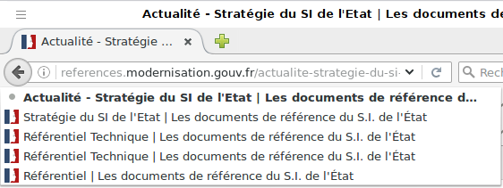

# Guide de l'intégrateur

##  Fiche 2&nbsp;: Navigation

- [Introduction - cas utilisateur][1]
- [Synthèse][9]
- [Liens d'accès rapide][2]
- [2 systèmes de navigation au moins][3]
- [Plan du site][4]
- [Titre de pages][5]
- [Collection de pages][6]
- [Page en cours de consultation dans le menu][7]
- [Fil d'Ariane][8]
- [Voir ailleurs / Ressources][10]
- [Critères RGAA][11]

### <a name="introduction"></a>Introduction - cas utilisateurs

Vous devez fournir aux utilisateurs au moins deux systèmes de navigation afin de couvrir un plus large spectre de stratégie de navigation dans les contenus du site. En effet, tous les utilisateurs ne naviguent pas de la même manière et certains systèmes de navigation peuvent s'avérer trop complexes à utiliser. Par exemple, un menu de navigation trop riche, comme un méga-menu, peut nécessiter beaucoup d'actions pour un utilisateur qui ne navigue qu'au clavier et donc rendre sa recherche d'information laborieuse. Proposer un second système permet d'aider ces utilisateurs qui ont des stratégies de navigation différentes.

Certains utilisateurs peuvent avoir des difficultés à atteindre la zone de contenu principal. Par exemple&nbsp;: les utilisateurs malvoyants qui utilisent une loupe d'écran ne voient pas la page dans sa globalité. Il peut être laborieux pour ces utilisateurs de devoir scroller tous les éléments communs des pages d'un site (l'en-tête, la navigation) pour atteindre le contenu principal à chaque fois. De même, les utilisateurs aveugles qui ont une lecture linéaire de la page doivent parcourir tous les éléments redondants (titre principal, navigation, etc.) avant d'atteindre le contenu principal.

Les utilisateurs qui ne peuvent pas utiliser de souris ou un système de navigation adapté restent néanmoins ceux qui rencontrent le plus de difficultés. Pour ces utilisateurs, la zone de contenu principal, comme tous les autres éléments du site ne peut être atteinte qu’avec la tabulation ce qui peut être particulièrement laborieux. 

Les liens d'accès rapide en début de contenu leur permettent de réduire considérablement leur temps de consultation, ils peuvent directement atteindre la zone de contenu principal.

### <a name="resume"></a>Synthèse

- Définir des titres de pages pertinents.
- Implémenter un lien d'accès rapide au contenu.
- Implémenter un lien d'accès rapide à la navigation principale.
- Implémenter des liens d'évitement pour tous les groupes de liens importants.
- Implémenter deux systèmes de navigation au moins.

### <a name="liensrapide"></a>Liens d'accès rapide

Vous devez fournir aux utilisateurs des liens d'accès rapide. Les liens d'accès rapide sont des ancres vers certains éléments de la page. Ainsi sur votre site, vous devez implémenter&nbsp;:
- un lien qui permet d'éviter ou d'accéder à la zone de contenu principale&nbsp;;
- un lien qui permet d'éviter ou d'accéder à chaque groupe de liens importants (notamment la navigation).

Ces liens d'accès rapide (ou d'évitement) doivent de préférence toujours être visibles. En effet, ils sont utiles aux utilisateurs aveugles, aux utilisateurs qui naviguent au clavier, mais également aux utilisateurs malvoyants qui utilisent une loupe d'écran. Ces derniers naviguent à la souris et si ces liens sont positionnés hors écran, il leur est impossible de les utiliser.

À défaut, si vous devez les positionner hors écran, vous devez au moins vous assurer que ces liens apparaissent à la prise de focus. Vous devez donc les positionner hors écran (`position:absolute`). N’utilisez surtout pas de propriétés CSS qui les rendent inactifs, telles que&nbsp;:
- <code lang="en">display: none;</code>&nbsp;;
- <code lang="en">visibility: hidden;</code>&nbsp;;
- <code lang="en">width</code> et <code lang="en">height</code> avec les valeurs <code>0</code> (<code lang="en">width: 0;height: 0;</code>)&nbsp;;
- <code lang="en">font-size: 0;</code>&nbsp;;
- attribut HTML5 <code lang="en">hidden</code>&nbsp;;
- propriété <code>aria-hidden="true"</code>.

Pour qu'ils soient efficaces, les liens d'accès rapide au contenu et à la navigation doivent être positionnés en début de code et en haut de page. En faire les premiers liens du code de votre page est la meilleure solution.

**Important&nbsp;:** Ces liens doivent toujours être situés à la même place dans la présentation. De plus, afin que les utilisateurs aveugles, qui ont une lecture linéaire de votre site, puissent s'y retrouver, ces liens doivent toujours être dans le même ordre dans le code source.

[Page de démonstration des cas d'implémentation des liens d'accès rapide][12]

### <a name="deuxsystemesnavigation"></a>2 systèmes de navigation au moins

Un site web doit proposer deux systèmes de navigation au moins, parmi&nbsp;: 
- une navigation principale&nbsp;;
- un moteur de recherche&nbsp;;
- un plan du site.

Pour que le moteur de recherche puisse être considéré comme un élément de navigation, il doit indexer toutes les pages du site. Ainsi, un moteur de recherche dans un catalogue qui ne permet pas de trouver la page des mentions légales du site n'est pas considéré comme un moteur de recherche.

Le plan du site quant à lui doit être représentatif de la structure générale du site. Il n'est pas demandé que soient référencées toutes les pages du site, mais seulement les pages menant aux rubriques principales. Par exemple, si le site dispose d'une rubrique «&nbsp;Actualités&nbsp;», il n'est pas nécessaire d'y faire figurer toutes les actualités publiées.

Il existe des cas particuliers pour lesquels cette recommandation est non applicable&nbsp;: 
- un site composé d'un faible nombre de pages (2 à 3 pages) peut ne fournir qu'un menu de navigation menant vers ces pages, le menu étant alors identique au plan du site.
- un site monopage («&nbsp;Single Page Application&nbsp;») peut ne fournir que des liens d'accès rapide aux différentes sections de la page, la fonction de recherche du navigateur (<kbd>Ctrl F</kbd>) permettant de chercher dans tout le contenu du site.

#### Ordre cohérent et présentation cohérente

Chaque système de navigation doit avoir sur chaque ensemble de pages un ordre et une présentation cohérente&nbsp;:

- le système de navigation est accessible depuis une fonctionnalité identique (par exemple, pour le plan du site, la fonctionnalité est un lien ayant pour intitulé «&nbsp;plan du site&nbsp;»)&nbsp;;
- la fonctionnalité est située à la même place dans la présentation (par exemple, le lien vers le plan du site est toujours situé en haut à gauche sur la page)&nbsp;;
- la fonctionnalité est toujours dans le même ordre relatif dans le code source (par exemple, le lien vers le plan du site est toujours le premier élément texte et le premier lien de la page).

### <a name="plandusite"></a>Plan du site

Le plan du site n'est pas obligatoire, il fait partie des 3 systèmes de navigation reconnus. Si vous intégrez un plan de site, vous devez vous assurer en plus que tous les liens sont pertinents et fonctionnels. [Vous pouvez utiliser l'outil de validation des liens du W3C][13] pour vous en assurer.

### <a name="titredepage"></a>Titre de page

Le titre des pages (balise `<title>`) est un élément de repère pour nombre d'utilisateurs.

Pour les personnes aveugles, utilisateurs de lecteurs d'écran, le titre de la page est le premier élément vocalisé. Pour des utilisateurs qui naviguent avec l'historique de navigation ou la liste des onglets, il est important qu'ils puissent retrouver les pages facilement en se basant sur leur titre.

Dans un certain nombre de cas, le titre de page est simple à construire, il reprend souvent le titre principal du contenu et le nom du site. Très souvent, ce n'est pas vous qui le créez, on vous impose sa construction (conception, référencement&hellip;). Dans d'autres cas, notamment pour les interfaces interactives, il faut veiller à rendre ces titres explicites&nbsp;:

- de collections de pages (résultats de recherche par exemple). Dans ces cas, il est important d'indiquer la pagination dans le titre&nbsp;;
- lorsqu'un formulaire renvoie des erreurs, le titre de la page doit le mentionner.



### <a name="collectionpages"></a>Collection de pages

Une collection de pages est un ensemble de pages reliées les unes aux autres par des liens et ayant un thème ou une nature commune. Par exemple, les pages de résultats d'un moteur de recherche ou les pages d'un catalogue sont des collections de pages.

Pour les pages d'une collection de pages, vous devez mettre à disposition de l'utilisateur&nbsp;: 
- un lien permettant d'accéder à la page suivante&nbsp;;
- un lien permettant d'accéder à la page précédente&nbsp;; 
- des liens permettant d'accéder à toutes les pages de la collection.

Lorsque le nombre de pages est très important, il est illusoire de vouloir mettre un lien vers chaque page. Dans ce cas, il est acceptable de présenter les liens par groupe de 10 liens par exemple («&nbsp;20-30&nbsp;»).
D'autres systèmes permettant d'atteindre une page quelconque d'une collection de pages peuvent être utilisés comme un champ de formulaire ou une liste `select` de navigation.

**Important&nbsp;:** Une navigation dans une collection de pages est un élément de navigation, vous devez donc l'implémenter dans un élément <code>&lt;nav&gt;</code> avec le <code>role="navigation"</code>. Et afin de distinguer les éléments de navigation, vous pouvez les labelliser au moyen de la propriété <code>aria-label</code>

````
<nav role="navigation" aria-label="navigation dans la collection de pages">
   [...]
</nav>
````

[Page de démonstration des cas d'implémentation de la navigation dans les collections de pages][14]

### <a name="encoursdeconsultation"></a>Page en cours de consultation dans le menu

Cette recommandation est de niveau AAA.

Indiquer la page en cours de consultation aux utilisateurs permet de donner des points de repère quant à leur localisation dans le site.
Lorsque vous indiquez la page en cours dans le menu de navigation, attention aux informations par la couleur et par la forme. Si vous décidez de mettre une couleur de fond différente au lien actif, n'oubliez pas d'ajouter un <code>title</code> sur le lien sur le modèle «&nbsp;[Titre de la page] en cours de consultation&nbsp;».

La meilleure des implémentations consiste à couvrir la plus grande part d'utilisateurs, et donc&nbsp;: 

- Utiliser une couleur de fond pour signifier la page active.
- Utiliser une forme adjacente au lien, par exemple une icône (pour les utilisateurs qui perçoivent mal ou pas les contrastes de couleurs).
- Ajouter un <code>title</code> sur le lien de la page active (pour les utilisateurs aveugles ou les utilisateurs qui utilisent des feuilles de styles utilisateurs).

[Page de démonstration pour la mise en évidence de la page active dans le menu de navigation][15]

### <a name="fildariane"></a>Fil d'Ariane

Cette recommandation est de niveau AAA.

Un fil d'Ariane est un moyen de navigation rapide et un repère dans le site, il doit permettre à l'utilisateur de s'orienter dans le site web.

Le fil d'Ariane doit donc être représentatif de la position de la page dans l'arborescence du site. Par exemple, les pages parentes doivent y être représentées.

### <a name="ailleurs"></a>Voir ailleurs / Ressources

- [Outil en ligne mis à disposition par le W3C permettant de vérifier que les liens d'une page sont fonctionnels][16]

### <a name="criteres"></a>Critères RGAA

- 8.5 [A]
- 8.6 [A]
- 12.1 [AA]
- 12.2 [AA]
- 12.3 [AA]
- 12.4 [AA]
- 12.5 [AA]
- 12.6 [AA]
- 12.7 [AA]
- 12.8 [AAA]
- 12.9 [AAA]
- 12.11 [A]
- 12.12 [AAA]

### Sommaire du guide de l'intégrateur

* [Introduction][17]
* [Fiche 1&nbsp;: Gabarit général][18]
* [Fiche 2&nbsp;: Navigation][19]
* [Fiche 3&nbsp;: Contenus][20]
* [Fiche 4&nbsp;: Tableaux][21]
* [Fiche 5&nbsp;: Liens][22]
* [Fiche 6&nbsp;: Formulaires][23]
* [Fiche 7&nbsp;: Prise de focus][24] 
* [Fiche 8&nbsp;: Respecter la distinction fond et forme][25]
* [Fiche 9&nbsp;: Images][26]
* [Fiche 10&nbsp;: Informations par la couleur et la forme][27] 
* [Fiche 11&nbsp;: Agrandissement des caractères][28]
* [Fiche 12&nbsp;: Multimédia][29]

[1]:	#introduction
[2]:	#liensrapide
[3]:	#deuxsystemesnavigation
[4]:	#plandusite
[5]:	#titredepage
[6]:	#collectionpages
[7]:	#encoursdeconsultation
[8]:	#fildariane
[9]:	#resume
[10]:	#ailleurs
[11]:	#criteres
[12]:	demo/2-navigation/access-rapide.html
[13]:	https://validator.w3.org/checklink
[14]:	demo/2-navigation/collection.html
[15]:	demo/2-navigation/page-active.html
[16]:	https://validator.w3.org/checklink
[17]:	0-intro.md
[18]:	1-gabarit-general.md
[19]:	2-navigation.md
[20]:	3-contenus.md
[21]:	4-tableaux.md
[22]:	5-liens.md
[23]:	6-formulaires.md
[24]:	7-focus.md
[25]:	8-distinction-fond-forme.md
[26]:	9-images.md
[27]:	10-infos-forme-couleur.md
[28]:	11-agrandissement-des-caracteres.md
[29]:	12-multimedia.md
